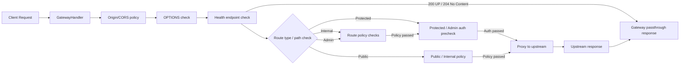
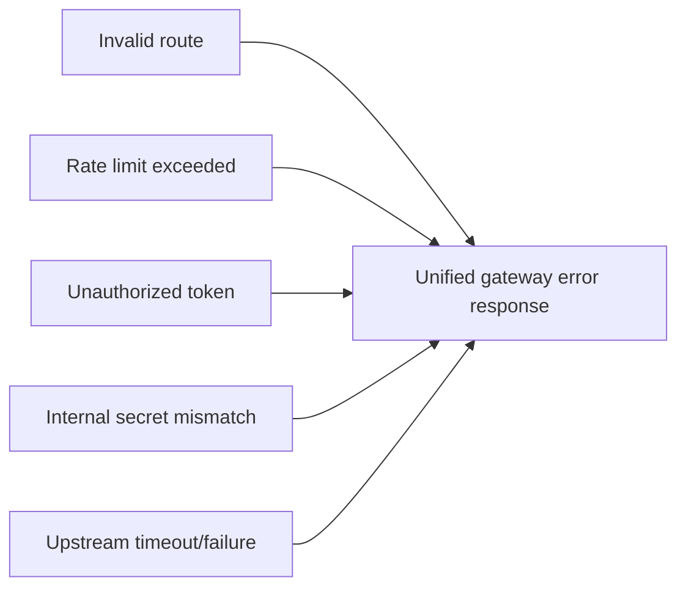

# 응답구조

## 목적
Gateway의 성공 응답과 실패 응답이 어떤 형태로 외부에 노출되는지 정의한다.

## 공통 추적 헤더
- 모든 Gateway 응답에는 `X-Request-Id`와 `X-Correlation-Id`가 포함된다.
- 성공 응답과 실패 응답 모두 동일하게 적용된다.
- 이 두 헤더는 추적용이며, downstream 응답과 독립적으로 유지된다.

## 성공 응답
- 성공 응답은 중간에서 포장하지 않고 업스트림의 `HTTP status`, `headers`, `body`를 그대로 전달한다.
- Gateway는 성공 JSON을 별도로 생성하지 않는다.
- 업스트림 응답은 클라이언트에 `passthrough` 된다.
- 다만 `X-Request-Id`, `X-Correlation-Id`는 Gateway가 응답 헤더에 추가한다.

### 성공 응답 예시
```text
status = 200
headers = Content-Type: application/json
body = {"id":"1","title":"doc"}
```

## 성공 흐름



## 실패 응답
- 실패 응답은 Gateway 내부 에러 처리 체인을 거쳐 만들어진다.
- 처리 순서:
  - `GatewayErrorCode`
  - `GatewayException`
  - `GatewayExceptionHandler`
  - `GatewayErrorResponse`
  - `Jsons`
- 실패 시 Gateway는 아래 JSON 형태로 응답한다.

### 실패 응답 예시
```json
{
  "code": "1006",
  "message": "접근이 허용되지 않는 경우",
  "path": "/v1/internal/ping",
  "requestId": "b7d5b8b0-2d2e-4f55-9f9b-7d4d5d7d6f01"
}
```

## 실패 코드 표
| HTTP Status | Code | message |
| :---: | :--- | :--- |
| 400 | 1000 | 요청 형식/파라미터가 잘못된 경우 |
| 400 | 1001 | 요청 채널을 판정할 수 없는 경우 |
| 400 | 1002 | 지원하지 않는 클라이언트 타입일 경우 |
| 401 | 1003 | 인증 정보가 없거나 현재 채널에서 쓸 수 있는 인증 수단이 없는 경우 |
| 401 | 1004 | 클라이언트 채널과 인증 수단이 일치하지 않는 경우 |
| 401 | 1005 | 인증 시도는 했지만 검증에 실패한 경우 |
| 403 | 1006 | 접근이 허용되지 않는 경우 |
| 404 | 1007 | 요청한 경로를 찾을 수 없는 경우 |
| 405 | 1008 | 허용되지 않은 HTTP 메서드의 경우 |
| 413 | 1009 | 요청 본문이 허용 크기를 초과한 경우 |
| 429 | 1010 | 요청이 너무 많은 경우 |
| 500 | 1011 | 게이트웨이 처리 중 오류가 발생한 경우 |
| 502 | 1012 | 업스트림 호출에 실패한 경우 |
| 504 | 1013 | 업스트림 응답 시간이 초과된 경우 |

## 실패 흐름


